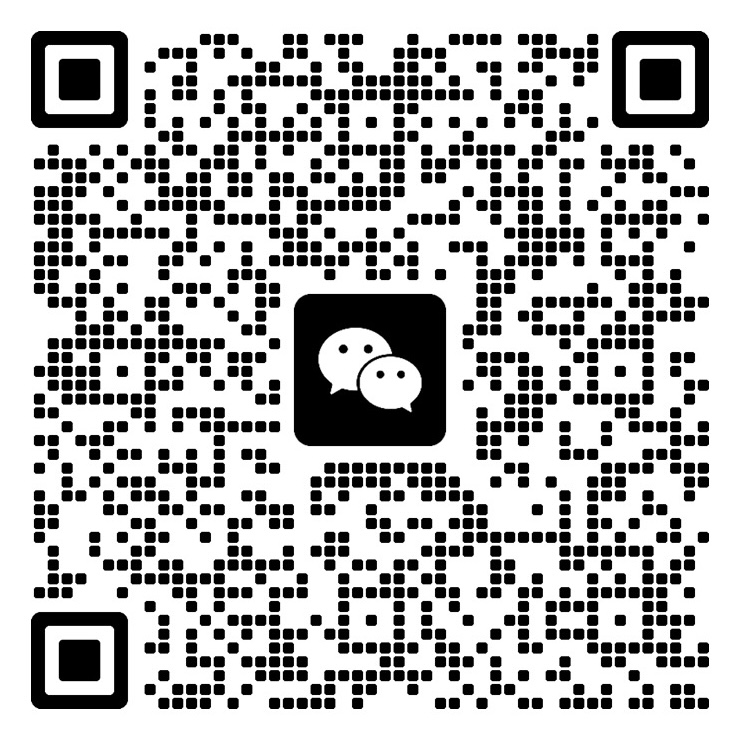

  

<h1 align="center">DooJank · 渡江客</h1>

Notes from the crossing. Philosophy, attention, and everyday life.

<a href="https://lumisum.github.io/doojank/">Read the journal ↗</a> · <a href="https://lumisum.github.io/doojank/zh/">中文阅读 ↗</a>

---

## About this journal

DooJank takes its name from 渡江客—a traveler crossing a river. I write from everyday experience, using philosophy to see familiar things more carefully. These essays hold observations and judgments that remain open to revision.

渡江客，是渡江的客人。这里留下关于人生、专注与变化的个人手记，在真实的日常里，慢慢看清自己与世界的关系。

WeChat publication「无来」 · Buddhist study group

---

## 经典阅读

佛典与心学原文，附无来的白话学习笔记。可只读原文，也可逐段对照。

<table>
  <tr>
    <td width="50%" align="center"><a href="https://lumisum.github.io/doojank/classics/diamond-sutra/"><strong>金刚般若波罗蜜经</strong></a></td>
    <td width="50%" align="center"><a href="https://lumisum.github.io/doojank/classics/heart-sutra/"><strong>般若波罗蜜多心经</strong></a></td>
  </tr>
  <tr>
    <td width="50%" align="center"><a href="https://lumisum.github.io/doojank/classics/platform-sutra/"><strong>六祖坛经</strong></a></td>
    <td width="50%" align="center"><a href="https://lumisum.github.io/doojank/classics/chuanxilu/"><strong>传习录</strong></a></td>
  </tr>
</table>

[进入经典阅读目录 ↗](https://lumisum.github.io/doojank/classics/)

---

## 文章时间线

按写作时间由近及远，愿你从一篇文章开始。

| 日期 | 文章 |
| --- | --- |
| 2026.10.08 | [只差一点，为什么困住了你？](https://lumisum.github.io/doojank/articles/2026-10-08-zhangda-yu-zizai/) · [English](https://lumisum.github.io/doojank/en/articles/2026-10-08-zhangda-yu-zizai/) |
| 2026.10.07 | [油门交给 AI，方向交给谁？](https://lumisum.github.io/doojank/articles/2026-10-07-ai-yu-ziji-de-zhexue/) · [English](https://lumisum.github.io/doojank/en/articles/2026-10-07-ai-yu-ziji-de-zhexue/) |
| 2026.10.07 | [人生如戏：入戏要真，出戏要快](https://lumisum.github.io/doojank/articles/2026-10-07-rensheng-ruxi/) · [English](https://lumisum.github.io/doojank/en/articles/2026-10-07-rensheng-ruxi/) |
| 2026.10.06 | [假期的聚会与分离，让我明白空亦是空](https://lumisum.github.io/doojank/articles/2026-10-06-jiaqi-juhe-yu-fenli/) · [English](https://lumisum.github.io/doojank/en/articles/2026-10-06-jiaqi-juhe-yu-fenli/) |
| 2026.10.05 | [我们从AI走到了SI](https://lumisum.github.io/doojank/articles/2026-10-05-ai-to-si/) · [English](https://lumisum.github.io/doojank/en/articles/2026-10-05-ai-to-si/) |
| 2026.10.04 | [AI因注意力机制异常强大，而人类的注意力却涣散了](https://lumisum.github.io/doojank/articles/2026-10-04-yanqian-wanxiang/) · [English](https://lumisum.github.io/doojank/en/articles/2026-10-04-yanqian-wanxiang/) |
| 2026.10.04 | [十一黄金周，为什么大家都出去散心？](https://lumisum.github.io/doojank/articles/2026-10-04-shiyi-huangjinzhou-sanxin/) |
| 2026.10.03 | [一千瓦的太空算力梦](https://lumisum.github.io/doojank/articles/2026-10-03-yiqianwa-taikong-suanli-meng/) |
| 2026.10.02 | [当“相”可以无限生成：从AI视频一直想到人类消失以后](https://lumisum.github.io/doojank/articles/insights/2026-10-02-ai-shipin-xiang-yu-xin/) |
| 2026.09.30 | [趁长假暂卸一身劳，借佛法照见职场愁](https://lumisum.github.io/doojank/articles/insights/2026-09-30-changjia-zhichang-chou/) |
| 2026.09.29 | [傻孩童误把抄袭当捷径 积善果当下步步皆修行。](https://lumisum.github.io/doojank/articles/insights/2026-09-29-fufa-zhuanzhu-dangxia/) |
| 2026.09.27 | [佛陀如何让家长每天多出一小时？](https://lumisum.github.io/doojank/articles/insights/2026-09-27-fotuo-rang-jiazhang-meitian-duo-yixiaoshi/) |
| 2026.09.27 | [佛陀如何改变了我的女司机同事？](https://lumisum.github.io/doojank/articles/insights/2026-09-27-fotuo-ruhe-gaibian-nv-siji-tongshi/) |
| 2026.09.26 | [佛陀如何教育自己的儿子？](https://lumisum.github.io/doojank/articles/insights/2026-09-26-fotuo-jiaoyu-luohouluo/) |
| 2026.09.25 | [如果佛陀看见π](https://lumisum.github.io/doojank/articles/insights/2026-09-25-ruguo-fotuo-kanjian-pi/) |
| 2026.09.24 | [马斯克的佛性是什么？](https://lumisum.github.io/doojank/articles/insights/2026-09-24-musk-de-yuanli/) |
| 2026.09.24 | [如来何以成佛祖？](https://lumisum.github.io/doojank/articles/insights/2026-09-24-rulai-heyi-cheng-fozu/) |
| 2026.09.24 | [有了佛学基础，情商会不会提高？](https://lumisum.github.io/doojank/articles/life/2026-09-24-fuxue-yu-qingshang/) |
