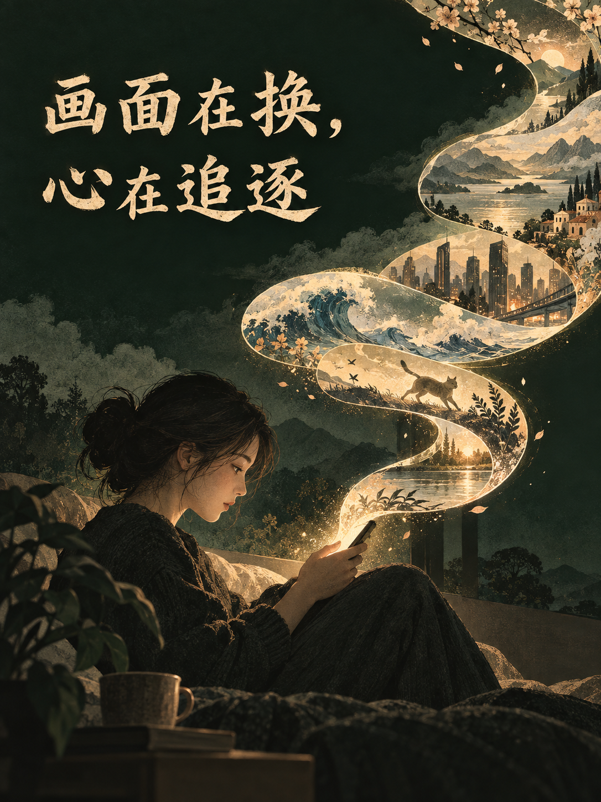
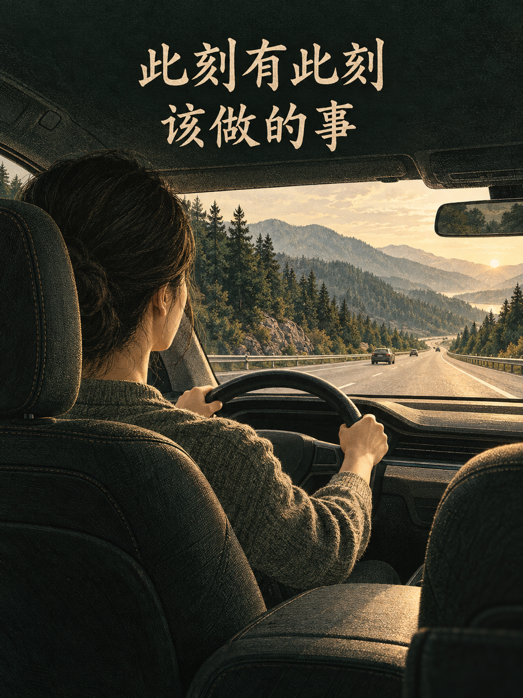
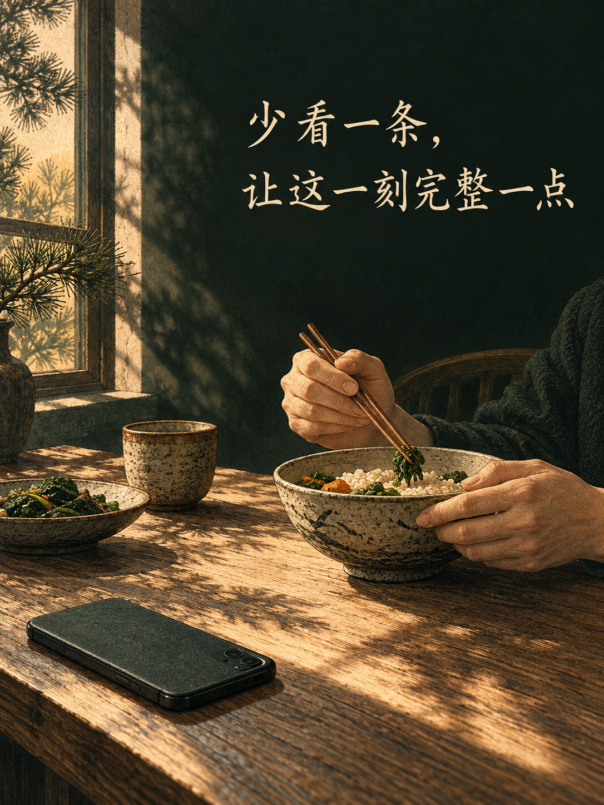

刷视频的时候，最容易被忽略的一件事，是我们正在怎样对待自己的心。

一开始，可能只是想休息几分钟。看见一个有趣的，停下来；下一个更有趣，再看一会儿。等到终于放下手机，时间已经过去不少。可眼前那些原本要做的事情，并没有因此变得容易。有时反而更不想做了，还想再看一点。

最近看见越来越多 AI 生成的视频，我更在意这个问题了。动物会说话，历史人物走进现代生活，不可能发生的事情，也能被做得像亲眼所见。画面越来越奇异，故事越来越出人意料，几乎总有一个新的场景等着我们。

我的判断很简单：普通视频已经应该少刷，更何况这些可以不断臆造、不断翻新的 AI 视频。这里说的“刷”，是没有明确目的、看完一条又接着一条的观看。好的讲解、真实的记录、值得欣赏的作品，当然有价值。可内容有价值，与自己怎样观看，仍然是需要分别考虑的两件事。

从佛法的角度看，我最想问的是：眼前的相越来越多，我们的心究竟更明白了，还是更容易被牵着走了？

## 一、手指在往下划，心却停在同一个地方

视频看起来一直在换。上一条是风景，下一条是争执，再下一条是一个让人羡慕的生活。画面不同，情绪也不同，似乎没有在任何一个地方停留。

但如果观察得再细一点，会发现，心可能始终停在一种期待里：下一条会不会更有意思？

喜欢的内容，希望再来一点；不喜欢的，赶紧划过去；觉得无聊，再换一个。手指做了很多次选择，可这些选择常常围绕着同一个要求：让我继续感到有趣，别让我停下来。

这让我对“住”有了一个更具体的体会。住，不一定是长久盯着同一幅画面。画面可以不断变，心却一直抓着“我要继续得到满足”不放。我们没有住在某一条视频上，却可能住在追逐下一条的念头里。

**手指在换画面，心却一直等着下一次满足。**

看见很多相，并不自动等于住相。读书、工作、走路，同样会接触许多东西。关键在于，接触以后，心怎样回应：能不能看过就过去，能不能在需要停的时候停下来，还是明明已经没有什么想看的，却依然舍不得结束？

如果每一次无聊，都立刻找一个新画面填进去，我们就很少有机会看清那个无聊。它从哪里来？是身体需要休息，是眼前的事情有困难，还是自己已经习惯了不断被逗引？这些问题还没有来得及出现，下一条视频已经来了。

于是，看得越多，也可能越少看见自己的心。

## 二、AI 可以不断造相，人却没有那么多时间

以前制作视频，需要一些条件。人要出场，场景要布置，拍摄和剪辑都要花时间。动画与特效早就能创造虚构世界，AI 带来的变化，是让许多原本费力的画面更容易被生成，也让奇异内容能够更快地接连出现。

这意味着，现实里少见的东西，在屏幕上可以越来越常见。一个会说话的动物不够有趣，还可以换一种；一个匪夷所思的故事看完了，还能接着生成另一个。内容可以不断翻新，而观看的人，一天仍然只有那么长。

我担心的，并不只是真假。有些视频明知是假的，也照样让人想看。我们清楚那个场景从未发生，却仍然被它唤起好奇、惊讶、喜欢或者厌恶。知道是生成的，并不能自动让心不受牵引。

《金刚经》说：“凡所有相，皆是虚妄。”经文的意思远比识别假视频丰富，不能把它缩成一句真假判断。但这些随时生成、随时替换的画面，确实让我更容易想到：一个相如此依赖条件，又如此容易变化，我为什么还要不断向它索取满足？

更值得警惕的是，奇异也会变得普通。看过一个惊人的场景，再出现类似的，就未必觉得新鲜了。于是内容继续增加变化，观看也继续寻找变化。如果不主动停下，结束这件事的，可能只有困倦、工作催促，或者手机没电。

屏幕总能给出下一条，却无法替我们决定，这一条是否值得花掉自己的时间。

所以，面对 AI 视频，节制尤其重要。它可以增加值得欣赏的创作，也可以增加没有必要承接的刺激。内容出现了，不意味着自己必须看；某个画面很有趣，也不意味着接下来的一小时都应该交给它。

## 三、每一次离开眼前，都有眼前的事情被留下

我以前写过一位女同事开车的事情。她平时很爱聊天，可车一上高速，就明显安静下来。原因很简单：高速上最重要的事情是把车开好，聊天会分散注意力，所以先专心驾驶。

那件事让我重新看《金刚经》第一品。佛陀著衣持钵，出城乞食，回来吃饭，收好衣钵，洗足，然后敷座而坐。经典还没有正式展开，生活已经一件一件地进行着。

在我的体会里，这里有一种很朴素的提醒：此刻有此刻该做的事。吃饭、走路、洗足，都有各自需要进入的过程。事情普通，心却可以认真。

大量刷视频容易挤走的，正是这份认真。吃饭时顺手看，工作遇到困难时拿起手机，听家人说话时又瞄一眼屏幕。每一次似乎都不长，但眼前的事情一次次被中断，人也一次次需要重新回来。

更容易被忽略的，是我们可能在反复练习一种应对方式：稍微无聊，就换；稍微费力，就走；稍微不舒服，就找一点新东西盖过去。

这样的方式如果延续到生活里，读一段需要思考的文字，会显得太慢；听一个人完整表达，会显得太长；做一件暂时没有结果的事情，也容易想先放一放。屏幕里的内容随时可以换，生活中的许多事情，却需要留在那里才能慢慢看明白。

这不意味着所有困难都来自视频。疲惫、压力、任务本身的难度，都影响一个人能否专注。可至少我们可以检查：自己是不是在那些本来可以投入的时刻，也习惯性地离开了？

**我们怎样使用这一刻的注意力，也在影响下一刻怎样面对事情。**

佛法所说的因果，放在这里，并不需要先想得很远。一次认真阅读，给了理解发生的机会；一次耐心倾听，给了关系被看见的机会。反过来，习惯了遇到困难就切走，也可能让下一次切走更加自然。具体结果还受许多条件影响，但我们参与其中的方式，本身就是一个条件。

## 四、把无聊填满以后，心里的问题未必解决了

有人可能会说：工作已经够累了，看点不用动脑的视频，有什么问题？

休息当然需要。人没有必要时时学习，也不必把每一分钟都变成产出。只是休息的方式，也值得观察。看完以后，身体和心有没有松下来？还是画面停了，心仍然想继续，连安静待一会儿都觉得难受？

有时，我们想避开的，也不只是劳累。一个问题还没想明白，一种失落还没处理，一件事情让人不愿意面对。打开视频以后，注意力暂时离开了它们，心里轻松一点。可等到屏幕关上，原来的事情仍在那里。

如果每次不安，都靠新的内容接住，那么那个不安就很少得到理解。我们忙着找让自己舒服的相，却没有看清，自己到底在怕什么、抓什么。

这也是我觉得“无住”特别现实的地方。它并不要求眼前没有画面，心里没有情绪。烦躁起来，可以知道烦躁起来；无聊出现，可以先看看无聊；想拿手机的念头来了，也可以知道自己想拿手机。看见一个念头，并不意味着马上要照着它行动。

这中间哪怕只是多出一点停顿，选择也就多了一点空间。

当然，无住也不能被理解成无限观看，只要心里说一句“我不执着”就行。自己是不是在追逐，身体是不是疲惫，该做的事情是不是被耽误，都需要如实面对。给观看设一个边界，减少容易让自己失去分寸的内容，也是承担责任的一部分。

慈悲同样可以朝向自己。没有必要因为刷久了，就马上责备自己没有自制力。先看清习惯怎样发生，给自己留出容易停下来的条件，再一点点调整。修行可以有认真，也可以有耐心。

## 五、少看一条，让这一刻完整一点

我现在更愿意把“少刷一点”理解成一种很具体的练习。它不需要从彻底戒掉开始，也不需要证明自己比别人清醒。先在一次观看里，重新找回主动结束的能力，就已经有意义。

打开以前，问一句：我现在想看什么？有明确内容，就去看；如果只是顺手打开，也可以承认自己是在寻找一点刺激。看的时候，偶尔留意一下：这段内容让我获得了什么，我还愿意继续把时间交给它吗？

准备结束时，最值得观察的，恰恰是“再看一条”的念头。它也许很轻，也许很强，但仍然只是此刻生起的一个念头。可以不急着满足它，先把手机放下，让眼前的事情重新进入视线。

不用立刻安排一项宏大的计划。把饭吃完，把这段文字读懂，把家人的话听完，或者只是安静坐一会儿。尝试在一件普通的事情里，待到它真正完成。

“应无所住而生其心”，在这里给我的提醒是：心可以不紧抓下一次刺激，也仍然能够认真参与生活。放下视频以后，并非无事可做。眼前的人、事和自己的身心，都值得被看见。

普通视频如此，AI 视频更值得如此。技术能够创造的相越来越丰富，我们也需要更清楚地决定，哪些值得进入自己的生活，哪些可以看见而不追随。

眼前万象，本来就看不尽。让人不断往下刷的，往往还是心里那个不愿结束的念头。

下一次它出现时，也许可以先不急着划过去。看看这颗心正在等什么，再让眼前这一刻，完整一点。
